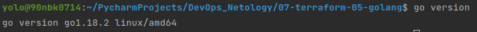
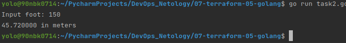
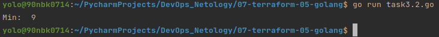
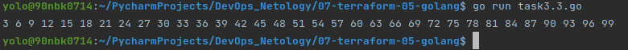

# Домашнее задание к занятию "7.5. Основы golang"

С `golang` в рамках курса, мы будем работать не много, поэтому можно использовать любой IDE. 
Но рекомендуем ознакомиться с [GoLand](https://www.jetbrains.com/ru-ru/go/).  

## Задача 1. Установите golang.
1. Воспользуйтесь инструкций с официального сайта: [https://golang.org/](https://golang.org/).
2. Так же для тестирования кода можно использовать песочницу: [https://play.golang.org/](https://play.golang.org/).

Установил golang.
<br><br>


## Задача 2. Знакомство с gotour.
У Golang есть обучающая интерактивная консоль [https://tour.golang.org/](https://tour.golang.org/). 
Рекомендуется изучить максимальное количество примеров. В консоли уже написан необходимый код, 
осталось только с ним ознакомиться и поэкспериментировать как написано в инструкции в левой части экрана.  

## Задача 3. Написание кода. 
Цель этого задания закрепить знания о базовом синтаксисе языка. Можно использовать редактор кода 
на своем компьютере, либо использовать песочницу: [https://play.golang.org/](https://play.golang.org/).

1. Напишите программу для перевода метров в футы (1 фут = 0.3048 метр). Можно запросить исходные данные 
у пользователя, а можно статически задать в коде.
    Для взаимодействия с пользователем можно использовать функцию `Scanf`:
    ```
    package main
    
    import "fmt"
    
    func main() {
        fmt.Print("Enter a number: ")
        var input float64
        fmt.Scanf("%f", &input)
    
        output := input * 2
    
        fmt.Println(output)    
    }
    ```
Выполнил, [код программы](task31/task31.go) в директории task31.
<br><br>
 
1. Напишите программу, которая найдет наименьший элемент в любом заданном списке, например:
    ```
    x := []int{48,96,86,68,57,82,63,70,37,34,83,27,19,97,9,17,}
    ```
Выполнил, [код программы](task32/task32.go) в директории task32.
<br><br>

1. Напишите программу, которая выводит числа от 1 до 100, которые делятся на 3. То есть `(3, 6, 9, …)`.

Выполнил, [код программы](task33/task33.go) в директории task33.
<br><br> 

## Задача 4. Протестировать код (не обязательно).

Создайте тесты для функций из предыдущего задания. 

Тесты сделал.
Тесты каждого задания лежат в соответствующей директории, понравилась возможность сделать отчет о покрытии кода в html.  
[Тесты для задания 1.](task31/task31_test.go)
[Тесты для задания 2.](task32/task32_test.go)  
[Тесты для задания 3.](task31/task33_test.go)

### Как cдавать задание

Выполненное домашнее задание пришлите ссылкой на .md-файл в вашем репозитории.

---
