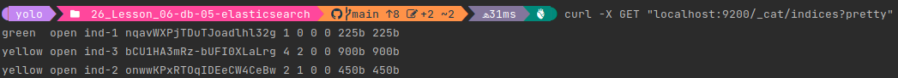
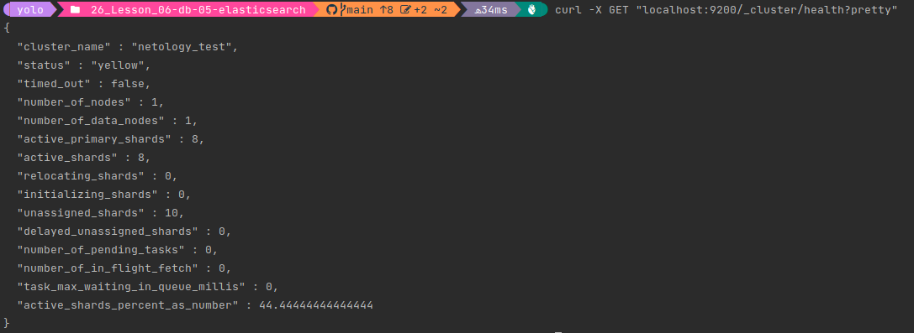
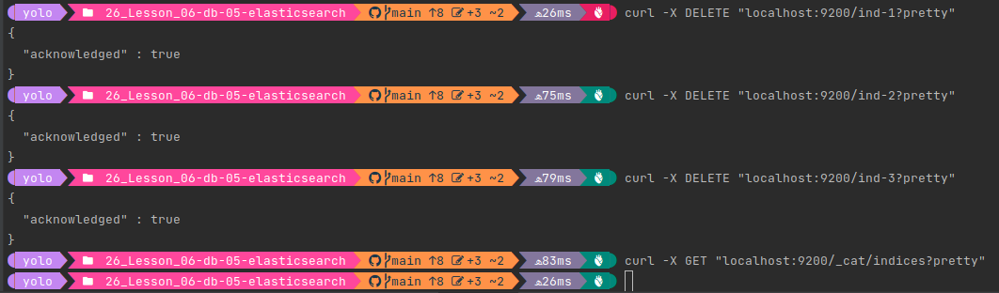
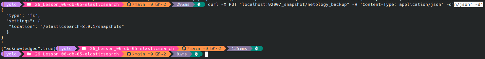
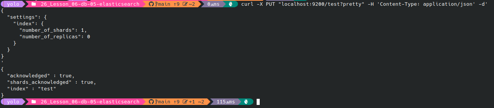
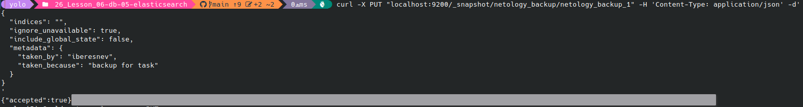
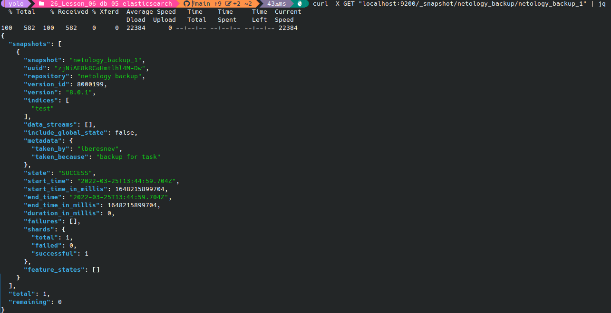
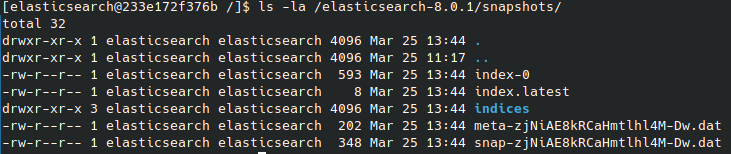
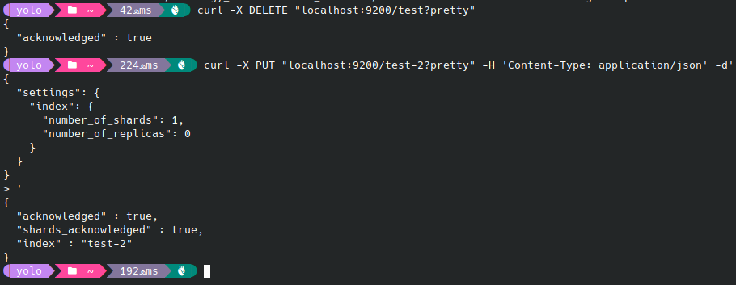
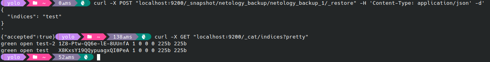

# Домашнее задание к занятию "6.5. Elasticsearch"

## Задача 1

Используя докер образ [centos:7](https://hub.docker.com/_/centos) как базовый и 
[документацию по установке и запуску Elastcisearch](https://www.elastic.co/guide/en/elasticsearch/reference/current/targz.html):

- составьте Dockerfile-манифест для elasticsearch
- соберите docker-образ и сделайте `push` в ваш docker.io репозиторий
- запустите контейнер из получившегося образа и выполните запрос пути `/` c хост-машины

Требования к `elasticsearch.yml`:
- данные `path` должны сохраняться в `/var/lib`
- имя ноды должно быть `netology_test`

- текст Dockerfile манифеста
```dockerfile
FROM centos:7
RUN yum -y install wget perl-Digest-SHA java-17-openjdk && yum clean all
RUN wget https://artifacts.elastic.co/downloads/elasticsearch/elasticsearch-8.0.1-linux-x86_64.tar.gz && \
    wget https://artifacts.elastic.co/downloads/elasticsearch/elasticsearch-8.0.1-linux-x86_64.tar.gz.sha512 && \
    tar -xzf elasticsearch-8.0.1-linux-x86_64.tar.gz && \
    rm -f elasticsearch-8.0.1-linux-x86_64.tar.gz
ADD elasticsearch.yml /elasticsearch-8.0.1/config/
ADD memory.options /elasticsearch-8.0.1/config/jvm.options.d/memory.options
ENV ES_HOME=/elasticsearch-8.0.1
RUN groupadd elasticsearch && useradd -g elasticsearch elasticsearch
RUN mkdir /var/lib/logs && chown elasticsearch:elasticsearch /var/lib/logs && mkdir /var/lib/data \
    && chown elasticsearch:elasticsearch /var/lib/data && chown -R elasticsearch:elasticsearch /elasticsearch-8.0.1/
RUN mkdir /elasticsearch-8.0.1/snapshots && chown elasticsearch:elasticsearch /elasticsearch-8.0.1/snapshots
USER elasticsearch
EXPOSE 9200
CMD ["/elasticsearch-8.0.1/bin/elasticsearch"]
```
- ссылку на образ в репозитории dockerhub
https://hub.docker.com/repository/docker/iaberesnev/netology_elasticsearch
- ответ `elasticsearch` на запрос пути `/` в json виде
```json
{
  "name": "511611abc8b8",
  "cluster_name": "netology_test",
  "cluster_uuid": "jWZZ9WDBQ52zsn5JfzvyBA",
  "version": {
    "number": "8.0.1",
    "build_flavor": "default",
    "build_type": "tar",
    "build_hash": "801d9ccc7c2ee0f2cb121bbe22ab5af77a902372",
    "build_date": "2022-02-24T13:55:40.601285296Z",
    "build_snapshot": false,
    "lucene_version": "9.0.0",
    "minimum_wire_compatibility_version": "7.17.0",
    "minimum_index_compatibility_version": "7.0.0"
  },
  "tagline": "You Know, for Search"
}

```

## Задача 2

В этом задании вы научитесь:
- создавать и удалять индексы
- изучать состояние кластера
- обосновывать причину деградации доступности данных

Ознакомтесь с [документацией](https://www.elastic.co/guide/en/elasticsearch/reference/current/indices-create-index.html) 
и добавьте в `elasticsearch` 3 индекса, в соответствии со таблицей:

| Имя | Количество реплик | Количество шард |
|-----|-------------------|-----------------|
| ind-1| 0 | 1 |
| ind-2 | 1 | 2 |
| ind-3 | 2 | 4 |
```commandline
curl -X PUT "localhost:9200/ind-1?pretty" -H 'Content-Type: application/json' -d'
{
  "settings": {
    "index": {
      "number_of_shards": 1,  
      "number_of_replicas": 0 
    }
  }
}
'
curl -X PUT "localhost:9200/ind-2?pretty" -H 'Content-Type: application/json' -d'
{
  "settings": {
    "index": {
      "number_of_shards": 2,  
      "number_of_replicas": 1 
    }
  }
}
'
curl -X PUT "localhost:9200/ind-3?pretty" -H 'Content-Type: application/json' -d'
{
  "settings": {
    "index": {
      "number_of_shards": 4,  
      "number_of_replicas": 2 
    }
  }
}
'
```

Получите список индексов и их статусов, используя API и **приведите в ответе** на задание.
  
Получите состояние кластера `elasticsearch`, используя API.  
  
Как вы думаете, почему часть индексов и кластер находится в состоянии yellow?  
В данном случае желтый статус кластера установился т.к. присутствуют индексы с желтым статусом.
Желтый статус индексов означает, что есть доступные шарды, но количество реплик не соответствует заданному.
В этом случае запросы к индексу продолжают возвращаться корректные результаты, но если откажет узел с мастер шардом,
то все данные будут потеряны.


Удалите все индексы.
```commandline
curl -X DELETE "localhost:9200/ind-1?pretty"
curl -X DELETE "localhost:9200/ind-2?pretty"
curl -X DELETE "localhost:9200/ind-3?pretty"
```  



## Задача 3

В данном задании вы научитесь:
- создавать бэкапы данных
- восстанавливать индексы из бэкапов

Создайте директорию `{путь до корневой директории с elasticsearch в образе}/snapshots`.

Используя API [зарегистрируйте](https://www.elastic.co/guide/en/elasticsearch/reference/current/snapshots-register-repository.html#snapshots-register-repository) 
данную директорию как `snapshot repository` c именем `netology_backup`.
```commandline
curl -X PUT "localhost:9200/_snapshot/netology_backup" -H 'Content-Type: application/json' -d'
{
  "type": "fs",
  "settings": {
   "location": "/elasticsearch-8.0.1/snapshots"
  }
}
'
```


Создайте индекс `test` с 0 реплик и 1 шардом и **приведите в ответе** список индексов.
```commandline
curl -X PUT "localhost:9200/test?pretty" -H 'Content-Type: application/json' -d'
{
  "settings": {
    "index": {
      "number_of_shards": 1,  
      "number_of_replicas": 0 
    }
  }
}
'
```


[Создайте `snapshot`](https://www.elastic.co/guide/en/elasticsearch/reference/current/snapshots-take-snapshot.html) 
состояния кластера `elasticsearch`.

```commandline
curl -X PUT "localhost:9200/_snapshot/netology_backup/netology_backup_1" -H 'Content-Type: application/json' -d'
{
  "indices": "",
  "ignore_unavailable": true,
  "include_global_state": false,
  "metadata": {
    "taken_by": "iberesnev",
    "taken_because": "backup for task"
  }
}
'
```

Получить информацию о snapshot'е.
`curl -X GET "localhost:9200/_snapshot/netology_backup/netology_backup_1" | jq `


**Приведите в ответе** список файлов в директории со `snapshot`ами.

Удалите индекс `test` и создайте индекс `test-2`. **Приведите в ответе** список индексов.
```commandline
curl -X DELETE "localhost:9200/test?pretty"
curl -X PUT "localhost:9200/test-2?pretty" -H 'Content-Type: application/json' -d'
{
  "settings": {
    "index": {
      "number_of_shards": 1,  
      "number_of_replicas": 0 
    }
  }
}
'
```

[Восстановите](https://www.elastic.co/guide/en/elasticsearch/reference/current/snapshots-restore-snapshot.html) состояние
кластера `elasticsearch` из `snapshot`, созданного ранее. 

**Приведите в ответе** запрос к API восстановления и итоговый список индексов.

```commandline
curl -X POST "localhost:9200/_snapshot/netology_backup/netology_backup_1/_restore" -H 'Content-Type: application/json' -d'
{
  "indices": "test"
}
'
```


