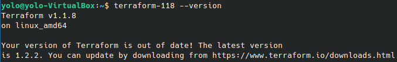
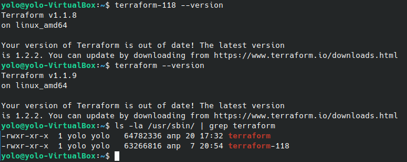

# Домашнее задание к занятию "7.1. Инфраструктура как код"

## Задача 1. Выбор инструментов. 
 
### Легенда
 
Через час совещание на котором менеджер расскажет о новом проекте. Начать работу над которым надо 
будет уже сегодня. 
На данный момент известно, что это будет сервис, который ваша компания будет предоставлять внешним заказчикам.
Первое время, скорее всего, будет один внешний клиент, со временем внешних клиентов станет больше.

Так же по разговорам в компании есть вероятность, что техническое задание еще не четкое, что приведет к большому
количеству небольших релизов, тестирований интеграций, откатов, доработок, то есть скучно не будет.  
   
Вам, как девопс инженеру, будет необходимо принять решение об инструментах для организации инфраструктуры.
На данный момент в вашей компании уже используются следующие инструменты: 
- остатки Сloud Formation, 
- некоторые образы сделаны при помощи Packer,
- год назад начали активно использовать Terraform, 
- разработчики привыкли использовать Docker, 
- уже есть большая база Kubernetes конфигураций, 
- для автоматизации процессов используется Teamcity, 
- также есть совсем немного Ansible скриптов, 
- и ряд bash скриптов для упрощения рутинных задач.  

Для этого в рамках совещания надо будет выяснить подробности о проекте, что бы в итоге определиться с инструментами:

1. Какой тип инфраструктуры будем использовать для этого проекта: изменяемый или не изменяемый?  
**ОТВЕТ:** Инфраструктура будет облачной и изменяемой. Т.к. ТЗ не окончательно, неизвестна нагрузка, её периодичность, географическая распределенность. Желание экономить на потребляемых ресурсах не в часы наибольшей нагрузки.
2. Будет ли центральный сервер для управления инфраструктурой?  
**ОТВЕТ:** Необходимость в центральном сервере зависит от используемых технологий управления конфигурацией серверов и ПО на нем. Если применим Ansible, который по легенде нам известен, то центральный сервер не нужен. В случае pull-систем управления(Salt) нужен центральный сервер. Для хранения файлов управления конфигураций Bash, terraform, ansible будем использовать Git-репозиторий.
3. Будут ли агенты на серверах?  
**ОТВЕТ:** Агенты чего? Если ПО управления конфигурации, то смотрим п.2, если агенты мониторинга, можно конечно использоваться и Zabbix, но согласно п.1. в динамической инфраструктуре удобней exporter'ы.
4. Будут ли использованы средства для управления конфигурацией или инициализации ресурсов?   
**ОТВЕТ:** Без них будет невозможно построить гибкую облачную инфраструктуру. Обслуживать и поддерживать её неизменность также очень трудоемко без подобных систем.
   Возможно, мы могли бы не использовать их в самом начале проекта(малые нагрузки, 2 сервера), но внедрение и использование подобных систем с самого начала, только упростит жизнь DevOPS инженеру.
 
В связи с тем, что проект стартует уже сегодня, в рамках совещания надо будет определиться со всеми этими вопросами.

### В результате задачи необходимо

1. Ответить на четыре вопроса представленных в разделе "Легенда".   
**ОТВЕТ:** Готово.  
2. Какие инструменты из уже используемых вы хотели бы использовать для нового проекта?   
**ОТВЕТ:** Как минимум. Terraform, Packer, Ansible, BASH - подготовка эталонного образа, инфраструктура и настройка ПО. Docker - стандартизация приложений. Kubernetes - контейнерная оркестрация. Teamcity для CI\CD.
3. Хотите ли рассмотреть возможность внедрения новых инструментов для этого проекта?   
**ОТВЕТ:** В списке не указаны инструменты и способы резервного копирования(как вариант BASH, но это не production-ready решение.), технология используемые для отказоусточивого хранения данных(ceph, glusterfs). VCS - первым делом, но уверен что он у них есть. Таск трекера - Jira или аналоги, системы управления документацией. HC Vault или аналог для секретных данных. Мониторинг grafana+prometheus для сервисов, graylog или ELK для логов, Zabbix для bare-metal инфраструктуры и сети.

Если для ответа на эти вопросы недостаточно информации, то напишите какие моменты уточните на совещании.


## Задача 2. Установка терраформ. 

Официальный сайт: https://www.terraform.io/

Установите терраформ при помощи менеджера пакетов используемого в вашей операционной системе.
В виде результата этой задачи приложите вывод команды `terraform --version`.
**ОТВЕТ:**  
Решение. Выполняю работу 09.06.2022, установка через официальный репозиторий недоступна. Воспользуемся зеркалом от Yandex. 
Т.к. установка terraform представляет собой скачивание бинарного файла и перемещение его в директорию с доступными исполняемыми файлами. 
План действий.
```bash
    wget https://hashicorp-releases.website.yandexcloud.net/terraform/1.1.8/terraform_1.1.8_linux_amd64.zip
    unzip terraform_1.1.8_linux_amd64.zip
    mv terraform /usr/sbin/terraform-118
    chmod +X /usr/sbin/terraform-118
    terraform-118 --version
``` 
<br><br>

## Задача 3. Поддержка легаси кода. 

В какой-то момент вы обновили терраформ до новой версии, например с 0.12 до 0.13. 
А код одного из проектов настолько устарел, что не может работать с версией 0.13. 
В связи с этим необходимо сделать так, чтобы вы могли одновременно использовать последнюю версию терраформа установленную при помощи
штатного менеджера пакетов и устаревшую версию 0.12. 

В виде результата этой задачи приложите вывод `--version` двух версий терраформа доступных на вашем компьютере 
или виртуальной машине.

```bash
    wget https://hashicorp-releases.website.yandexcloud.net/terraform/1.1.9/terraform_1.1.9_linux_amd64.zip
    unzip terraform_1.1.9_linux_amd64.zip
    mv terraform /usr/sbin/terraform
    chmod +X /usr/sbin/terraform
    terraform --version
``` 
<br><br>
---

### Как cдавать задание

Выполненное домашнее задание пришлите ссылкой на .md-файл в вашем репозитории.

---