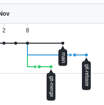
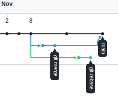
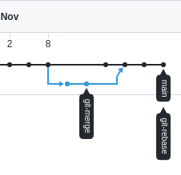

## Домашнее задание для урока №4

### Задание «2.3. Ветвления в Git»
1) Стартовая ситуция.
<br><br>
2) Результат после ```git merge git-merge```<br>
<br>
3) Результат после ```git rebase -i main```<br>
И ```git push```
<br><br>

